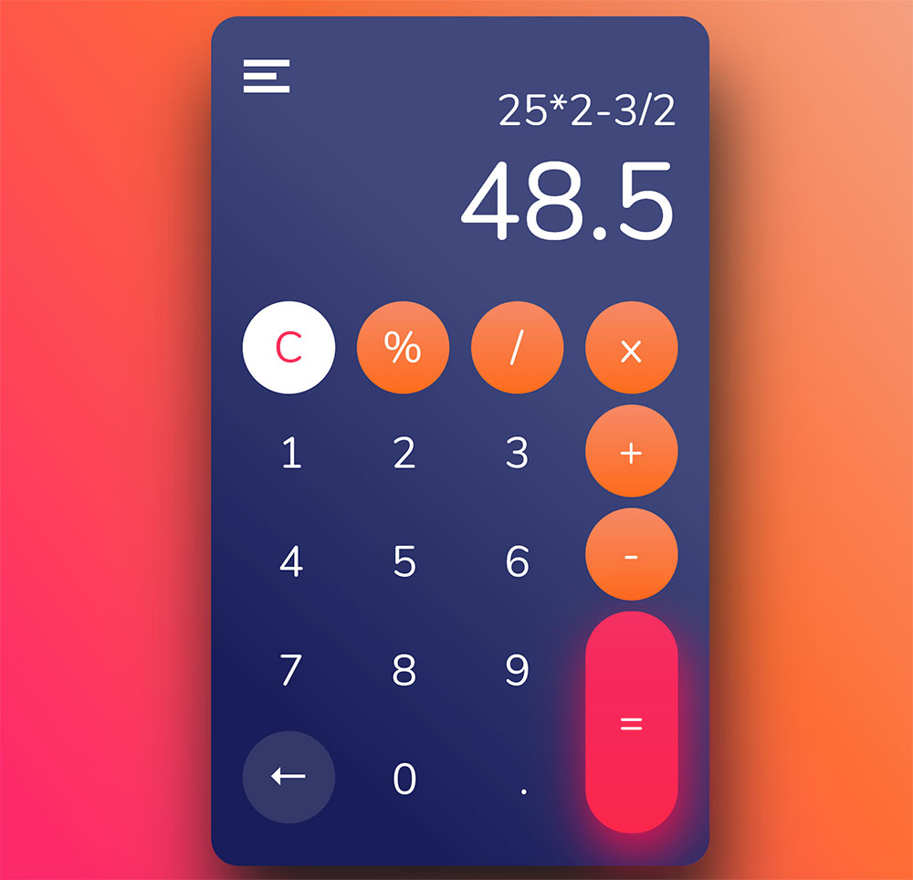

<h1>ac-react-calculator</h1>

A React calculator built with [React.js](https://github.com/facebook/react), [emotion](https://github.com/emotion-js/emotion) and [hooks](https://reactjs.org/docs/hooks-intro.html).
 I've used [this calculator design concept](https://www.uplabs.com/posts/calculator-animation-icons) which is designed by Maximiliano Catani.

## Live Demo

You can test on https://ac-react-calculator.netlify.com

## Preview

## Running Locally

1. Clone this repo
2. Type `cd ac-react-calculator` to enter the project folder
3. Run `npm install` and install dependencies
4. Run `npm start` and visit [localhost:3000](http://localhost:3000)

## Build

1. Run `npm run build`
1. The compiled version will be in `/build/`

It correctly bundles React in production mode and optimizes the build for the best performance.

The build is minified and the filenames include the hashes. 
Your app is ready to be deployed!

See the section about [deployment](https://facebook.github.io/create-react-app/docs/deployment) for more information.

## Eject

**Note: this is a one-way operation. Once you `eject`, you can’t go back!**

If you aren’t satisfied with the build tool and configuration choices, you can `eject` at any time. This command will remove the single build dependency from your project.

Instead, it will copy all the configuration files and the transitive dependencies (Webpack, Babel, ESLint, etc) right into your project so you have full control over them. All of the commands except `eject` will still work, but they will point to the copied scripts so you can tweak them. At this point you’re on your own.

You don’t have to ever use `eject`. The curated feature set is suitable for small and middle deployments, and you shouldn’t feel obligated to use this feature. However we understand that this tool wouldn’t be useful if you couldn’t customize it when you are ready for it.

## Learn More

You can learn more in the [Create React App documentation](https://facebook.github.io/create-react-app/docs/getting-started).

To learn React, check out the [React documentation](https://reactjs.org/).